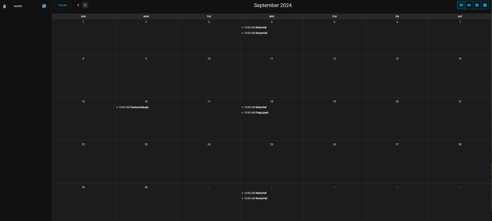
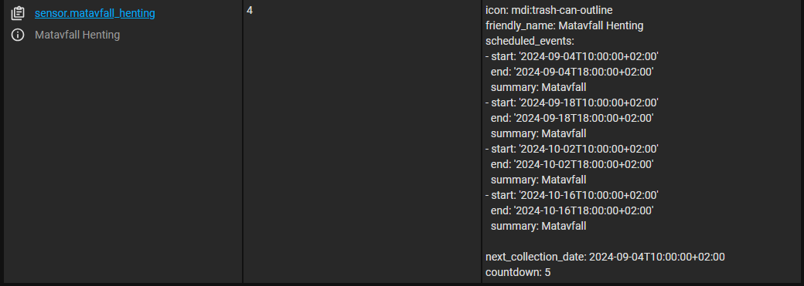

# Wasteplan IR
[![GitHub Release][releases-shield]][releases]
[![License][license-shield]](LICENSE)
[![hacs][hacsbadge]][hacs]
![Project Maintenance][maintenance-shield]

Wasteplan component for [Innherred Renovasjon](https://innherredrenovasjon.no/).

## Installation

1. Install [HACS](http://hacs.xyz/)
2. Add Custom Repository "github.com/thordy/wasteplan_ir" as Integration
4. Search for and install the "Wasteplan IR" integration
5. Restart Home Assistant
6. Install Wasteplan IR from the integrations screen.

## Attributions
- Code is heavily based on the great [wasteplan_trv] repository by [jonkristian] 🙌
- Component is based on [integration_blueprint] from [ludeeus].

## Sensors
This integration will create a new [calendar](https://www.home-assistant.io/integrations/local_calendar/) with the given name, and add all upcoming pickup times to it, like the following


To create sensors for each pickup, to show countdown until each pickup, you can add the following [template sensor](https://www.home-assistant.io/integrations/template/) to your configuration.

**Note** make sure to replace `calendar.waste` with the name you used to create your calendar on line `8` and `14`
```
template:
  - trigger:
      - platform: time_pattern
        hours: "/1"
    action:
      - service: calendar.get_events
        target:
          entity_id: calendar.waste # Replace with your calendar name
        data:
          duration:
            days: 60
        response_variable: tommeplan
      - variables:
          all_events: "{{ tommeplan['calendar.waste'].events }}" # Replace with your calendar name
          matavfall: "{{ all_events | selectattr('summary', 'search', 'atavfall', true) | list }}"
          restavfall: "{{ all_events | selectattr('summary', 'search', 'Restavfall', true) | list }}"
          pappogpapir: "{{ all_events | selectattr('summary', 'search', 'Papp/papir', true) | list }}"
          plastemballasje: "{{ all_events | selectattr('summary', 'search', 'Plastemballasje', true) | list }}"
          glassogmetall: "{{ all_events | selectattr('summary', 'search', 'Glass- og metallemballasje', true) | list }}"
    sensor:
      - name: Matavfall Henting
        unique_id: tommeplan_matavfall
        icon: mdi:trash-can-outline
        state: |
          {{ matavfall | count() }}
        attributes:
          scheduled_events: |
            {{ matavfall }}
          next_collection_date: |
            {{ (matavfall | first).start }}
          countdown: |
            {{ int((as_timestamp((matavfall | first).start) - as_timestamp(today_at('00:00')))/86400)}}

      - name: Restavfall Henting
        unique_id: tommeplan_restavfall
        icon: mdi:trash-can-outline
        state: |
          {{ restavfall | count() }}
        attributes:
          scheduled_events: |
            {{ restavfall }}
          next_collection_date: |
            {{ (restavfall | first).start }}
          countdown: |
            {{ int((as_timestamp((restavfall | first).start) - as_timestamp(today_at('00:00')))/86400)}}

      - name: Papp og Papir Henting
        unique_id: tommeplan_pappogpapir
        icon: mdi:trash-can-outline
        state: |
          {{ pappogpapir | count() }}
        attributes:
          scheduled_events: |
            {{ pappogpapir }}
          next_collection_date: |
            {{ (pappogpapir | first).start }}
          countdown: |
            {{ int((as_timestamp((pappogpapir | first).start) - as_timestamp(today_at('00:00')))/86400)}}

      - name: Plastemballasje Henting
        unique_id: tommeplan_plastemballasje
        icon: mdi:trash-can-outline
        state: |
          {{ plastemballasje | count() }}
        attributes:
          scheduled_events: |
            {{ plastemballasje }}
          next_collection_date: |
            {{ (plastemballasje | first).start }}
          countdown: |
            {{ int((as_timestamp((plastemballasje | first).start) - as_timestamp(today_at('00:00')))/86400)}}

    - name: Glass og Metall Henting
      unique_id: tommeplan_glassogmetall
      icon: mdi:trash-can-outline
      state: |
        {{ glassogmetall | count() }}
      attributes:
        scheduled_events: |
          {{ glassogmetall }}
        next_collection_date: |
          {{ (glassogmetall | first).start }}
        countdown: |
          {{ int((as_timestamp((glassogmetall | first).start) - as_timestamp(today_at('00:00')))/86400)}}
```

This will give you sensors like the following, which again can be used to display the countdown in the frontend via a template sensor like
```
{{ state_attr('sensor.matavfall_henting', "countdown") }}
```



[releases-shield]: https://img.shields.io/github/v/release/thordy/wasteplan_ir.svg
[releases]: https://github.com/thordy/wasteplan_ir/releases
[license-shield]: https://img.shields.io/github/license/thordy/wasteplan_ir.svg
[hacsbadge]: https://img.shields.io/badge/HACS-Custom-orange.svg
[hacs]: https://github.com/hacs/integration
[maintenance-shield]: https://img.shields.io/badge/maintainer-Thord%20Setsaas%20%40thordy-blue.svg

[wasteplan_trv]: https://github.com/jonkristian/wasteplan_trv/
[jonkristian]: https://github.com/jonkristian
[integration_blueprint]: https://github.com/ludeeus/integration_blueprint
[ludeeus]: https://github.com/ludeeus
